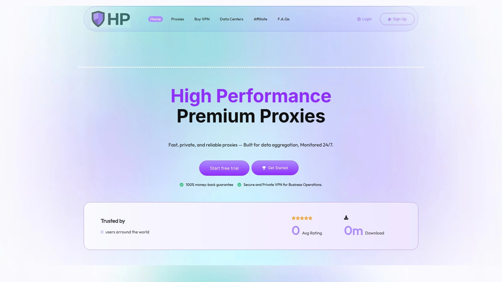
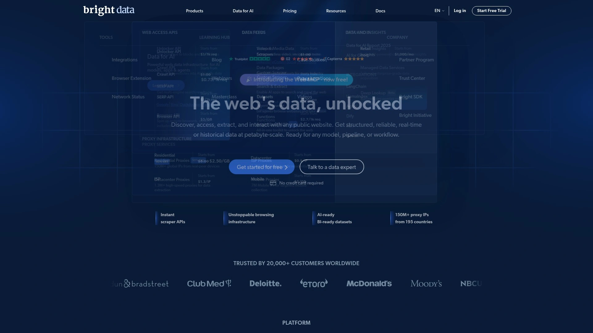
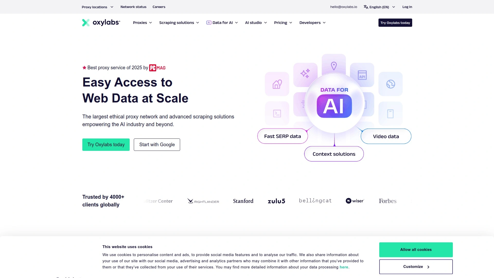
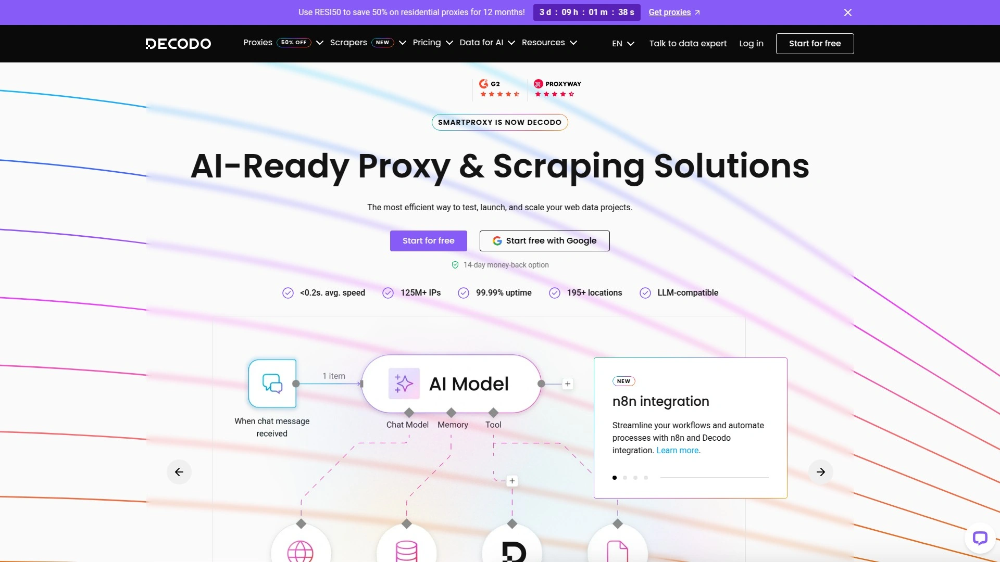
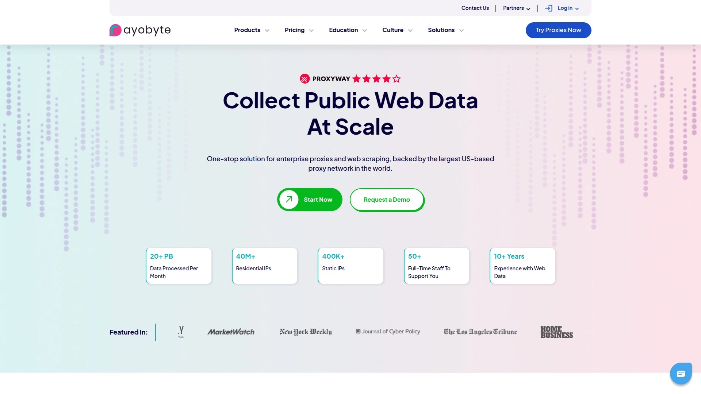
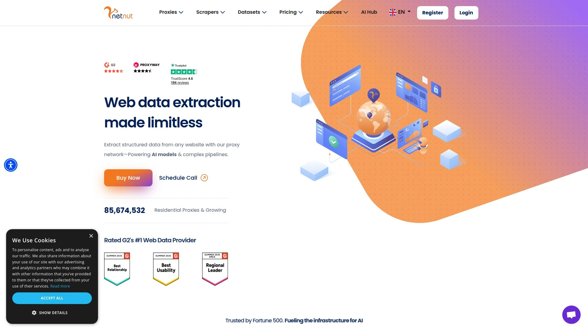

# 2025's Top 10 Best Proxy Services

Websites block IPs that make too many requests. Location restrictions prevent access to regional content. Manual IP rotation wastes time that could build actual value. Modern proxy services solve these challenges by routing traffic through distributed networks, masking your origin, and enabling automated rotation that bypasses detection systems. Whether scraping public data, managing multiple accounts, or accessing geo-blocked content, proxies provide the infrastructure for stable, anonymous connections at scale.

This compilation covers providers handling real-world proxy needs—datacenter speed for high-volume tasks, residential legitimacy for anti-bot systems, flexible rotation options, and transparent pricing that scales with usage rather than hiding costs in complex tiers.

***

## **[High Proxies](https://highproxies.com)**

Budget-friendly datacenter proxies with 99.99% uptime and unlimited bandwidth across all plans.

High Proxies delivers straightforward proxy solutions built on diverse cloud infrastructures across multiple datacenters, ensuring maximum uptime and redundancy without the complexity of enterprise platforms. Servers are fine-tuned for peak stability, maintaining 99.99% uptime that keeps operations running when reliability matters. This consistent availability suits long-term projects requiring dependable connections over weeks or months.

Every proxy includes unlimited bandwidth with support for up to 100 simultaneous threads, eliminating hidden throttling that slows competitive services. This multithreading capability means running 100 concurrent tasks without compromising speed—crucial for large-scale web scraping or social media automation. Advanced RAID SATA configurations with ample RAM maintain performance even under heavy loads.

Transparent pricing eliminates setup fees and hidden charges—you get exactly what you pay for starting at $0.57 monthly. Monthly IP refresh ensures high availability and data integrity for extended campaigns. Users can select proxies from multiple cities and subnets, tailoring setups to exact geographic targeting needs. This flexibility matters when testing localized content or managing region-specific accounts.

Speed tests confirm impressive performance: private proxies reach download speeds up to 1 Gbps with 500 Mbps uploads, while social media proxies deliver 100-200 Mbps—more than adequate for posting and account management tasks. Even shared proxies maintain 10-20 Mbps for light browsing. Response times average 19ms ping with 55.43 Mbps download and 31.96 Mbps upload speeds.

The platform offers specialized proxy categories including private, shared, social media, classified ad, and price aggregation proxies. Each category is optimized for specific use cases, from Instagram automation to Craigslist posting to e-commerce price monitoring. Round-the-clock support through dedicated ticketing systems ensures technical issues get addressed promptly.

IP authentication support includes both username/password and IP whitelist options for secure, convenient access. The user-friendly interface makes navigation intuitive even for first-time proxy users. For businesses and marketers needing affordable, reliable proxies without sacrificing performance, High Proxies offers transparent value with proven uptime.

***

## **[Bright Data](https://brightdata.com)**

Enterprise proxy platform with 150M+ residential IPs and advanced gateway routing across 100+ countries.

Bright Data operates the largest commercial proxy network, offering all four proxy types—datacenter, ISP, residential, and mobile—with filtering precision extending to ZIP codes and operating systems. This comprehensive infrastructure serves enterprises requiring industrial-scale data collection with institutional reliability. The residential network alone advertises over 150 million IPs sourced ethically through transparent partnerships.

Gateway server architecture strategically places load balancers in dozens of locations for efficient routing. Traffic never passes through third-party bottlenecks, ensuring consistent performance without interruptions from unstable peer connections. Advanced features include request caching that returns frequently accessed pages within seconds while reducing costs by 5%, and DNS resolution options letting you choose whether lookups happen at gateways or proxy servers.

Rotation flexibility transforms from basic to highly customizable once you engage the Proxy Manager tool. Establish sessions lasting as long as IPs remain available, or rotate with every request. Domain whitelisting/blacklisting restricts proxy usage to approved sites, preventing misuse. Unlimited concurrent threads and ports mean no artificial connection limits beyond your account balance.

Protocol support spans HTTP, HTTPS, and SOCKS5 (including UDP traffic) across standard ports plus custom options above 1024 for datacenter and ISP proxies. IPv6-only pools include roughly 150,000 proxies with automatic IPv4 fallback for unsupported websites. Pre-trained AI models integrated within data collection APIs accelerate insight generation without custom training.

Pricing operates on pay-as-you-go models starting at $15 per GB, or prepaid plans ranging from $500 Starter ($12.5/GB) through custom Enterprise tiers. The company offers first deposit matching up to $500 for new customers testing large-scale deployments. This premium positioning suits businesses where data quality and legal sourcing justify higher costs.

Customer support includes dedicated account managers for larger plans, with remote integration sessions ensuring smooth technical onboarding. Over 1,000 pre-built connectors integrate with popular scraping frameworks and business intelligence tools. For enterprises requiring comprehensive proxy infrastructure with proven compliance, Bright Data delivers institutional-grade capabilities.

***

## **[Oxylabs](https://oxylabs.io)**

Premium residential proxies with 175M IP pool, 24-hour sticky sessions, and dedicated customer success teams.

Oxylabs controls one of the largest verified proxy pools, advertising over 100 million residential IPs with actual availability exceeding competitors in most tested locations including the US. IPs are sourced through Honeygain bandwidth-sharing app, direct ISP partnerships, and app developer relationships—ensuring ethical collection with transparent origins. This legitimacy matters for businesses requiring defensible data gathering practices.

Geographic precision goes beyond standard country selection to include state, city, ASN, ZIP code, and even coordinate-based targeting. This granular control enables highly specific use cases like testing local search results or accessing city-level content restrictions. The tradeoff is that not all filters combine—you choose either country or ASN rather than both simultaneously.

Sticky sessions maintain identical IPs for durations up to 24 hours when using credential authentication, or 10 minutes with IP whitelisting. Sessions drop after one minute of inactivity, encouraging efficient connection management. The gateway system automatically routes requests through geographically scattered load balancers—European traffic passes through German servers first for optimized latency.

Two integration methods accommodate different complexity needs. Country entry modifies gateway addresses based on chosen countries and generates different ports for sticky sessions—simple but limited to country-level targeting. Backconnect entry uses one unchanging gateway with parameters appended to usernames, enabling full functionality including ZIP targeting and custom session durations.

Traffic metering charges by bandwidth consumption rather than request counts, with effectively unlimited concurrent connections as long as account balance remains positive. SOCKS5 protocol includes UDP support currently in beta requiring account manager activation. Response times average 0.6 seconds—among the fastest in the residential proxy category.

Pricing follows pay-as-you-go structures suitable for medium to large businesses with established data needs. Free trials are available for companies meeting minimum criteria. Dedicated support teams provide personalized assistance, with documentation covering integration examples for popular programming languages. For organizations prioritizing pool size and support quality over cost, Oxylabs delivers premium reliability.

***

## **[Decodo (SmartProxy)](https://decodo.com)**

Value-focused residential proxies with 100M+ IPs and datacenter plans starting at $0.026 per IP.

Decodo (formerly SmartProxy) positions itself as accessible enterprise-grade proxies optimized for daily operations in AI, automation, and data-driven industries. The residential network exceeds 100 million IPs delivering solid performance for routine data collection without premium pricing structures. Datacenter proxies start at just $0.026 per IP with free trials letting users test infrastructure before committing.

Private datacenter proxies route traffic through dedicated servers with each IP reserved for single users, ensuring greater stability and lower block rates compared to shared alternatives. This exclusive access provides consistent performance ideal for projects requiring reliable uninterrupted connections. Shared datacenter options cost less but carry higher detection risk as multiple users access identical IPs.

The platform differentiates residential and datacenter use cases clearly. Residential proxies use real consumer device IPs connected through ISPs, making them harder to detect and more effective against anti-bot systems. Datacenter proxies sacrifice some anonymity for significantly higher speeds at lower costs, running on data center servers that websites can potentially flag. Understanding this distinction helps match proxy types to specific project needs.

Lightning-fast response times and high success rates make Decodo suitable for web scraping, streaming optimization, and multi-account management. Legal usage remains compliant as long as activities don't violate criminal law or website terms of service. The company emphasizes ethical collection practices across all proxy products.

Integration support includes detailed documentation and visual guides explaining setup processes. Static datacenter options provide stable IPs for scenarios requiring consistent addresses over extended periods. For small businesses and individual developers seeking value without enterprise complexity, Decodo delivers functional proxies at accessible price points.

***

## **[IPRoyal](https://iproyal.com)**

Affordable proxy solutions with SOCKS5 support, city/state targeting, and instant IP rotation on demand.

IPRoyal targets budget-conscious users through competitive pricing across datacenter, residential, mobile, and ISP proxy types. This multi-format availability lets customers match proxy types to specific tasks without paying for unnecessary premium features. Dedicated datacenter IPs provide constant stable access for users needing consistent addresses, while rotating options change IPs at regular intervals to reduce automated activity detection.

City and state targeting enables location-specific proxy selection, particularly useful for localized content access, ad verification, and region-based testing. Instant IP changes complement scheduled auto-rotation by letting users manually trigger new addresses on demand when situations require immediate switching. This combination of automated and manual control accommodates both systematic workflows and responsive adjustments.

SOCKS5 protocol support handles diverse traffic types including HTTP, FTP, and SMTP—expanding use cases beyond standard HTTP proxies. The Chrome extension provides seamless proxy management directly in browsers without adjusting system settings. Users add, configure, and switch between proxies instantly while viewing remaining residential traffic in real-time. Search functionality and favorites system simplify managing large proxy collections.

The dashboard mirrors IPRoyal's web interface functionality, letting users select countries, states, cities, protocols, and rotation options without leaving the extension. This convenience eliminates repeated logins to separate control panels. API access enables programmatic proxy control for developers requiring automated management.

Pricing structures emphasize affordability particularly for individual users and small businesses with limited budgets. While premium providers offer larger pools and advanced features, IPRoyal fills the gap for cost-sensitive projects where basic functionality suffices. Rotating and sticky session options provide flexibility between constantly changing IPs and maintaining consistent addresses. For users prioritizing price over maximum pool size, IPRoyal delivers functional infrastructure at accessible rates.

***

## **[Webshare](https://www.webshare.io)**

Free tier with 10 proxies plus 500K+ datacenter IPs and 80M residential addresses across 195 countries.

Webshare removes entry barriers by providing 10 free proxies without requiring credit cards—letting users test infrastructure before financial commitment. This risk-free introduction suits beginners exploring proxy technology or developers prototyping scraping workflows. The free tier includes sufficient functionality for learning proxy integration basics and evaluating performance.

Three proxy product categories address different performance and anonymity needs. Datacenter/ISP proxies deliver high speeds and reliability for tasks prioritizing velocity over detection avoidance. Static residential proxies combine datacenter performance with residential legitimacy—addresses associated with ISPs rather than data centers. Full residential proxies provide maximum anonymity through real consumer device IPs across 195 countries.

The dashboard provides real-time performance tracking, customizable plans tailored to actual usage, and centralized management eliminating manual IP/port/credential juggling. Browser extension integration changes proxy locations with clicks rather than complex configuration. Country-based filtering and IP search simplify finding appropriate proxies for specific geographic requirements.

24/7 technical support ensures assistance availability regardless of time zones. Dedicated account managers provide strategic guidance for larger deployments. API documentation covers integration with popular programming languages and frameworks. The platform emphasizes privacy by avoiding data sales—user browsing information stays internal.

Independent reviews highlight Webshare as beginner-friendly with intuitive interfaces that lower learning curves. Speed tests confirm adequate performance for common use cases including social media management, e-commerce scraping, and basic automation. The combination of free entry, straightforward pricing, and geographic coverage makes Webshare accessible for users transitioning from manual browsing to proxy-assisted workflows.

***

## **[Rayobyte](https://rayobyte.com)**

Quality dedicated proxies with 300K IP pool, unlimited threads/traffic, and monthly refresh cycles.

Rayobyte specializes in datacenter proxy infrastructure spanning 300,000 IP addresses distributed across nine ASNs and 20,000 C-class subnets. This distribution strategy reduces mass ban risks compared to concentrated IP blocks—when one address gets flagged, thousands of others remain unaffected. The network operates with 99.99% uptime guarantees backed by performance-optimized hardware.

Three shared proxy formats accommodate different workflow preferences. Traditional lists contain addresses shared with only two users, balancing cost and performance. Port-based rotation assigns 20 rotating IPs to each purchased port, automatically cycling between 10-120 minute intervals. Pool access provides 60,000 rotating proxies for maximum variety. Dedicated proxies remain static throughout subscription periods with optional monthly refreshes.

Unlimited threads, traffic, and domains eliminate common restrictions that limit other providers. Users can open any number of concurrent connections, consume unlimited bandwidth, and access any websites without artificial caps. This unrestricted approach suits high-volume operations like enterprise SEO monitoring or large-scale price intelligence.

Location coverage focuses primarily on US cities with granular targeting, plus Western European, Southern American, and Southeast Asian country options. The 30-country datacenter network provides geographic diversity for projects requiring international presence. SOCKS5 protocol support expands use cases beyond HTTP connections.

Pricing for dedicated proxies starts at $12.50 for 5 IPs ($2.50 per IP), while shared options begin at $0.30 per GB or $5 for 5 IPs ($1 per IP). Two-day free trials allow hands-on testing before purchase. Support channels include chat, ticketing, email, and Slack for larger plans. The dashboard interface may feel less polished than premium alternatives, but functionality remains comprehensive. For users needing quality US-focused datacenter proxies with flexible consumption models, Rayobyte delivers proven infrastructure.

***

## **[SOAX](https://soax.com)**

Flexible residential proxies with 155M IPs, unlimited concurrent sessions, and UDP/QUIC protocol support.

SOAX operates 155 million residential proxies with 99.95% success rates enabling efficient data acquisition in less time. Automatic IP rotation prevents blocked scrapers by constantly cycling addresses, while customizable sticky sessions maintain consistent IPs for activities requiring stable identities. This dual approach accommodates both high-velocity scraping and session-dependent workflows like social media automation.

Unlimited concurrent sessions remove connection restrictions—open as many simultaneous connections as projects demand without hitting artificial limits. The platform supports HTTP(S), SOCKS5, and UDP/QUIC protocols, ensuring smooth compatibility regardless of technical requirements. UDP support particularly benefits real-time applications and streaming scenarios where standard TCP overhead creates latency.

Web Optimizer improves error handling and browsing stability for tasks involving social media, e-commerce, and data gathering. MaxIP maximizes unique IP counts for operations requiring extensive rotation without address repetition. Advanced targeting filters by country, state, city, and ASN with all plans, enabling precise geographic control. Look-a-like rotation and web browsing optimizations further customize behavior.

API access simplifies programmatic proxy management without manual dashboard interactions. Response headers can be customized, while compatibility extends to popular programming languages. The platform maintains 99.9% network uptime ensuring operations run without disruptions. Ethically sourced proxies meet compliance requirements for businesses concerned about IP origin legality.

Pricing starts at $4 for 1 GB with 3-day trials available for testing. The code PROXYWAY35% provides 35% discounts. Customer success managers assist with account optimization. For users needing flexible filtering with stable infrastructure, SOAX provides residential proxies suitable for diverse use cases.

***

## **[NetNut](https://netnut.io)**

Direct ISP residential proxies with one-hop connectivity, 85M IP pool, and exceptionally low latency.

NetNut's architecture stands out through one-hop connectivity where traffic routes directly through ISP networks rather than end-user devices. This elimination of third-party routing prevents bottlenecks common in traditional residential proxies, resulting in faster response times and lower latency. All traffic flows exclusively through NetNut infrastructure with no disconnections from unstable peer connections.

The very large IP pool particularly excels in premium locations like the US and UK where NetNut maintains substantial address quantities. Servers located on major internet routes and ISP network connectivity points ensure quality control since NetNut directly manages all equipment. This self-operated model provides reliability guarantees impossible with externally-sourced infrastructure.

Rotation options include per-request changes or sticky sessions maintaining IPs until they go offline. Long session features enable connections lasting up to one hour—useful for activities requiring extended IP consistency. Integration uses single gateway addresses with location filters and session parameters appended to usernames. IP whitelisting generates port lists for software lacking credential support.

Detailed usage statistics go beyond basic traffic metrics to include success rates, response times, and connection error breakdowns. This analytical depth helps diagnose performance issues and optimize scraping strategies. Dedicated account managers provide full integration support including remote sessions when needed. The platform connects with popular scraping tools through standardized protocols.

Pricing starts at $99 for 28 GB ($3.45/GB) with 7-day free trials for qualifying companies. Enterprise plans scale to 2TB monthly ($3750) with volume discounts on annual commitments. HTTP, HTTPS, and SOCKS5 protocol support accommodates diverse technical requirements. For medium and large businesses requiring fast residential proxies with direct ISP connections, NetNut delivers differentiated infrastructure.

***

## **[Infatica](https://infatica.io)**

Enterprise residential proxies with 15M+ IPs, 99.9% uptime, and 0.4-second response times.

Infatica delivers enterprise-grade residential proxies optimized for secure, reliable, anonymous data access with performance and uptime exceeding typical consumer-focused services. The 15 million IP pool spans Americas, Europe, and Asia with powerful geo-targeting capabilities providing tens of thousands of addresses across major cities. This global distribution enables localized data collection vital for targeting regional markets and monitoring competitors.

Response times average 0.4 seconds—significantly faster than many residential providers—while maintaining 99.9% uptime that ensures continuous operation. All proxies are 100% ethically sourced through transparent partnerships rather than questionable peer-to-peer networks. This ethical foundation matters for businesses requiring defensible data collection practices that comply with evolving regulations.

Rotation time selection lets users customize IP change intervals matching specific workflow needs. Country, city, and ZIP code targeting provides geographic precision for accessing localized content and testing regional variations. Authentication supports both login/password credentials and IP whitelisting to accommodate different security preferences.

The web interface balances accessibility for business owners with power user features including traffic dashboards, quickstart guides, and product overviews. API management enables scalability and refined control for technical users requiring programmatic proxy administration. These dual interfaces prevent feature overload while preserving depth.

Less CAPTCHA interference results from residential IPs appearing human-like to anti-bot systems like reCAPTCHA and Cloudflare. Automatic rotation quickly replaces any banned addresses, keeping data pipelines flowing. Plan options scale from small trials to custom enterprise deployments with 24/7 priority support. For companies needing reliable residential infrastructure with fast response times, Infatica provides enterprise-focused stability.

***

## FAQ

**What's the difference between residential and datacenter proxies for my use case?**

Residential proxies use real consumer device IPs assigned by ISPs, making them nearly impossible to detect and ideal for bypassing sophisticated anti-bot systems on platforms like social media or e-commerce sites. Datacenter proxies route through server infrastructure, offering 5-10x faster speeds at lower costs but higher detection risk. Choose residential for anti-bot challenges, datacenter for speed-critical tasks like price monitoring where blocks are less common.

**How do I avoid getting my proxies blocked when scraping websites?**

Implement rotating proxies that change IPs automatically between requests rather than hammering sites with the same address. Add random delays between requests (2-5 seconds) to mimic human behavior. Use residential or mobile proxies for sites with aggressive detection. Respect robots.txt files and rate limits. Most importantly, use sticky sessions for activities requiring consistent IPs like logging into accounts.

**Can I use the same proxy service for multiple different projects simultaneously?**

Yes, most providers support unlimited concurrent connections as long as bandwidth limits aren't exceeded. You can run web scraping, social media automation, and ad verification projects simultaneously using different IPs from the same provider. Use proxy management tools or APIs to organize proxies by project, assign different geographic locations to each task, and track usage separately for better cost allocation.

---

## Conclusion

Proxy services eliminate the technical barriers preventing efficient data collection, multi-account management, and global content access. Modern providers deliver rotating residential IPs that bypass detection, high-speed datacenter proxies for volume tasks, and flexible targeting that matches exact geographic requirements. The platforms in this compilation handle real operational needs—consistent uptime when reliability matters, transparent pricing without hidden fees, and support that solves integration challenges quickly.

For budget-conscious businesses and developers needing dependable datacenter proxies with unlimited bandwidth, proven 99.99% uptime, and straightforward pricing starting under $1 monthly, **[High Proxies](https://highproxies.com)** delivers stable infrastructure without enterprise complexity. The platform handles social media automation, web scraping, and classified ad posting through specialized proxy categories optimized for each use case.
